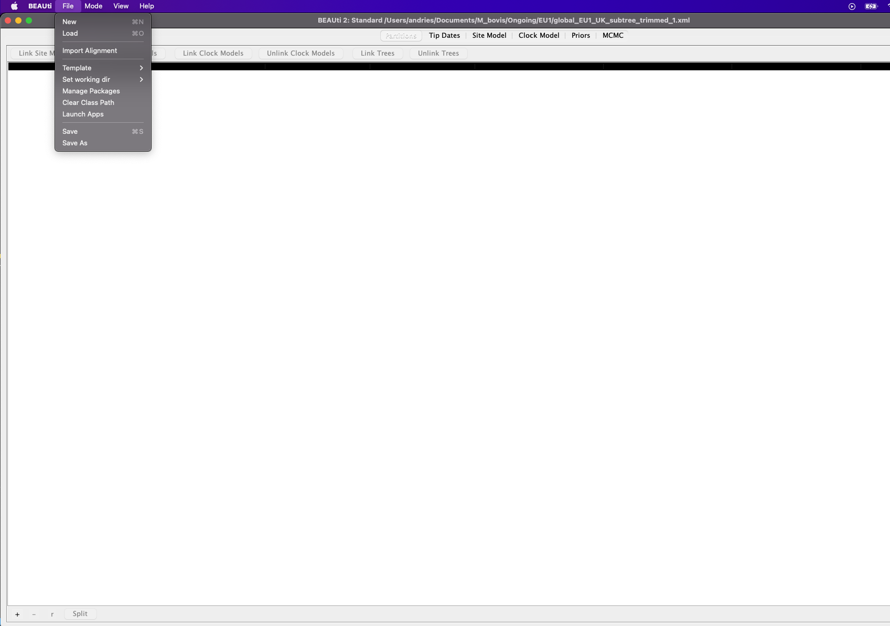
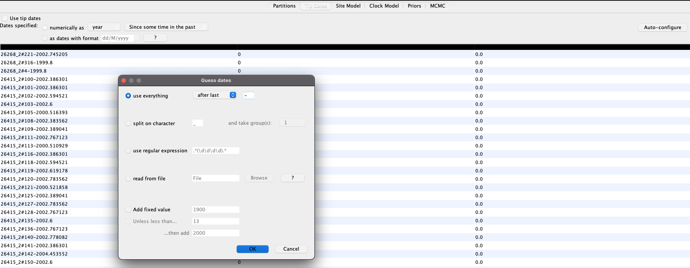
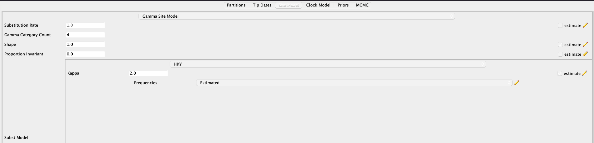
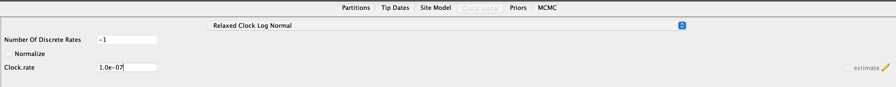
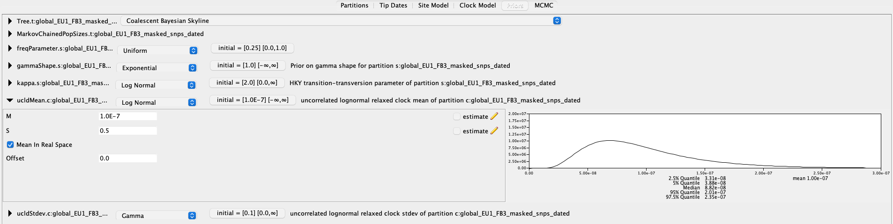

Running Beast2 on the HPC GPU clusters (Work in progress)
=========================================================

Instructions for setting up and running BEAST2 analyses on the Cambridge HPC.

Download and install BEAST2 locally
-----------------------------------

Download the BEAST2 package with Java for your operating system at `<https://www.beast2.org/>`_ and follow the instructions for
installation.

Download and install BEAST2 on the HPC
--------------------------------------

Download the tarred and zipped BEAST2 package binaries to a location of your choice (e.g. home directory):

.. code-block:: console

    $ wget https://github.com/CompEvol/beast2/releases/download/v2.6.6/BEAST.v2.6.6.Linux.tgz

Untar the downloaded file:

.. code-block:: console

    $ tar fxz BEAST.v2.6.6.Linux.tgz

Create alignment
----------------

The alignment to be used to generate the BEAST xml file can be generated in a couple of different ways: either use ``snp-sites`` to extract the variant sites 
from a whole genome alignment or use the filtered polymorphic site file created by ``Gubbins``.  The alignment will need to have the dates for each sample added
to the sample names in the fasta alignment using ``seqkit``.  You will need a tab delimited file containing the original sample names and the dated sample names:

.. code-block:: console

    $ head dates.txt

    $ 12754_8#27	12754_8#27-1982

You can then run seqkit on your alignment to change the sample names:

.. code-block:: console

    $ conda activate seqkit

    $ seqkit replace -p "(.+)" -r '{kv}' -k dates.txt alignment.fasta > alignment_dated.fasta

Create xml file in Beauti
-------------------------

To create the BEAST xml file, load the dated alignment file you created with ``seqkit`` into ``Beauti`` using `File/Import alignment` and click `OK` to the `nucleotide`
option on the `Choose the datatype of alignment` pop-up box:

Next extract the dates from the sample names by clicking `Use tip dates` on the `Tip Dates` tab then `Auto-configure`. Change the `after first` box to `after last` and
replace the ``_`` with ``-`` then click `OK`:

The dates for each sample should now be added to `Beauti`.  Now click the `Site Model` tab to set substitution model. Change `Gamma Category Count` to ``4`` and change 
`Subst Model` to `HKY`:

Now set the clock model on the `Clock Model` tab. We're going to use a relaxed log normal clock model as this allows the substitution rate to vary from branch to branch and
is appropriate for most datasets. Change `Strict Clock` to `Relaxed Clock Log Normal`.  It's good practice to set a prior clock rate.  Either use a previously published estimate
for your species or else use the slope you calculated if you created a root to tip plot.  Set to `Clock.rate` to your subsitution rate e.g. ``1e-07``:

Now we need to decide on a population model and set some other priors. Depending on your species/dataset a constant or exponential population size may be more appropriate. However, 
a `Coalescent Bayesian Skyline` model allows for different population sizes through time and allows use to construct skyline plots which show the estimated population size or genetic
diversity through time. Change `Yule Model` to `Coalescent Bayesian Skyline`.  All the priors can be set but for most datasets changing the `ucldMean.c` option is all we need to do.  
Change `Uniform` to `Log Normal` and click on the arrow to expand the options. Change `M` (Median) to the subsitution rate you used on the `Clock Model` tab, set `S` (standard deviation)
to ``0.5`` and click the tickbox next to `Mean In Real Space`:

Edit HPC submission script
--------------------------

Thanks to Noémie for providing this HPC submission script that makes use of the ``beagle`` libraries installed on the HPC.  The script
can be found `here <https://github.com/pathgenevocam/hpc_submission>`_. 

Submit job(s)
-------------

.. code-block:: console

    $ sbatch --export=file=beast.xml run_beast_2.6.6-GPU.sh

