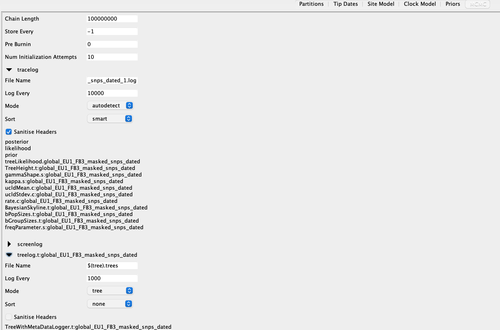

Running Beast2 on the HPC GPU clusters (Work in progress)
=========================================================

Instructions for setting up and running BEAST2 analyses on the Cambridge HPC.

Download and install BEAST2 locally
-----------------------------------

Download the BEAST2 package with Java for your operating system at `<https://www.beast2.org/>`_ and follow the instructions for
installation.

Download and install BEAST2 on the HPC
--------------------------------------

Download the tarred and zipped BEAST2 package binaries to a location of your choice (e.g. home directory):

.. code-block:: console

    $ wget https://github.com/CompEvol/beast2/releases/download/v2.6.6/BEAST.v2.6.6.Linux.tgz

Untar the downloaded file:

.. code-block:: console

    $ tar fxz BEAST.v2.6.6.Linux.tgz

Create alignment
----------------

The alignment to be used to generate the BEAST xml file can be generated in a couple of different ways: either use ``snp-sites`` to extract the variant sites 
from a whole genome alignment or use the filtered polymorphic site file created by ``Gubbins``.  The alignment will need to have the dates for each sample added
to the sample names in the fasta alignment using ``seqkit``.  You will need a tab delimited file containing the original sample names and the dated sample names:

.. code-block:: console

    $ head dates.txt

    $ 12754_8#27	12754_8#27-1982

You can then run ``seqkit`` on your alignment to change the sample names:

.. code-block:: console

    $ conda activate seqkit

    $ seqkit replace -p "(.+)" -r '{kv}' -k dates.txt alignment.fasta > alignment_dated.fasta

Create xml file in Beauti
-------------------------

To create the BEAST xml file, load the dated alignment file you created with ``seqkit`` into ``Beauti`` using ``File/Import alignment`` and click ``OK`` to the ``nucleotide``
option on the ``Choose the datatype of alignment`` pop-up box:

.. image:: beauti_1.png
  :width: 800
  :alt: Beauti load page

Next extract the dates from the sample names by clicking ``Use tip dates`` on the ``Tip Dates`` tab then ``Auto-configure``. Change the ``after first`` box to ``after last`` and
replace the ``_`` with ``-`` then click ``OK``:

.. image:: beauti_2.png
  :width: 800
  :alt: Beauti tip dates

The dates for each sample should now be added to ``Beauti``.  Now click the ``Site Model`` tab to set substitution model. Change ``Gamma Category Count`` to ``4`` and change 
``Subst Model`` to ``HKY``:

.. image:: beauti_3.png
  :width: 800
  :alt: Beauti tip dates

Now set the clock model on the ``Clock Model`` tab. We're going to use a relaxed log normal clock model as this allows the substitution rate to vary from branch to branch and
is appropriate for most datasets. Change ``Strict Clock`` to ``Relaxed Clock Log Normal``.  It's good practice to set a prior clock rate.  Either use a previously published estimate
for your species or else use the slope you calculated if you created a root to tip plot.  Set to ``Clock.rate`` to your subsitution rate e.g. ``1e-07``:

.. image:: beauti_4.png
  :width: 800
  :alt: Beauti tip dates

Now we need to decide on a population model and set some other priors. Depending on your species/dataset a constant or exponential population size may be more appropriate. However, 
a ``Coalescent Bayesian Skyline`` model allows for different population sizes through time and allows us to construct skyline plots which show the estimated population size or genetic
diversity through time. Change ``Yule Model`` to ``Coalescent Bayesian Skyline``.  All the priors can be set but for most datasets changing the ``ucldMean.c`` option is all we need to do.  
Change ``Uniform`` to ``Log Normal`` and click on the arrow to expand the options. Change ``M`` (Median) to the subsitution rate you used on the ``Clock Model`` tab, set `S` (Standard Deviation)
to ``0.5`` and click the tickbox next to ``Mean In Real Space``:

.. image:: beauti_5.png
  :width: 800
  :alt: Beauti tip dates

The last thing we need to do in ``Beauti`` is set the MCMC options.  Change ``Chain Length`` to ``100000000``.  Under ``tracelog`` edit the filename as appropriate.  For most ``BEAST`` runs 
we want three replicates so call this first log file something like ``beast_run_1.log``.  Change the ``Log Every`` to ``10000``.  Under ``treelog`` change the filename to ``beast_run_1.trees``
and change the ``Log Every`` to ``10000``. Save the xml file using ``File/Save`` and call it something like ``beast_run_1.xml``:

The last thing to do before running BEAST is add the number of constant sites to the xml file and create an additional two copies of the xml file so there are three replicates.  Extract the
number of constant sites from your whole genome alignment using ``snp-sites -C`` then open ``beast_run_1.xml`` in a text editor like ``Sublime``. There are two code blocks that need to be
edited so BEAST takes account of the number of constant sites in your alignment.  At the top of the alignment block change 

``<data id="alignment_dated" spec="Alignment" name="alignment">``

to

``<data id="alignmentVar" dataType="nucleotide">``

At the bottom of the alignment block after the ``</data>`` tag, add the following code block:

``<data id="alignment_dated" spec="FilteredAlignment" filter='-' data='@alignmentVar' constantSiteWeights='713758 1355838 1350340 715019'/>``

Change the constant sites after ``constantSiteWeights=`` to the values you extracted using ``snp-sites -C``.  Save the xml file.  To create your replicates, use ``File/Save As...`` in your text
editor and save the file as ``beast_run_2.xml``.  Scroll to the bottom of the file and change ``fileName="beast_run_1.log"`` to ``fileName="beast_run_2.log"`` and ``fileName="beast_run_1.trees"``
to ``fileName="beast_run_2.trees"``.  Save the file then repeat the same process to create a third replicate file i.e. ``beast_run_3.xml``.  Copy the files to the HPC.  Create a directory
for each replicate e.g. ``run1``, ``run2``, ``run3``

Edit HPC submission script
--------------------------

Thanks to Noémie for providing this HPC submission script that makes use of the ``beagle`` libraries installed on the HPC.  The script
can be found `here <https://github.com/pathgenevocam/hpc_submission>`_. Copy the script to the directory where your run directories are located and edit the script in ``nano`` as follows:
change ``#SBATCH -J JOBNAME`` to a sensible job name to help you track your jobs e.g. ``#SBATCH -J beast_1``.  Change ``#SBATCH -A GROUPNAME`` to the project you're using for your GPU analyses.
Depending on whether you're using a ``SL2`` (36 hours) or ``SL3`` (12 hours) project, edit ``#SBATCH --time=12:00:00`` accordingly.  For the first attempt we'll use the first ``beast`` command 
in the submission script.  Change the location of the ``beast`` binary to where yours is located. Copy the submission script to each of your run directories and use the command below to submit 
your jobs.

Submit job(s)
-------------

To submit your ``beast`` jobs:

.. code-block:: console

    $ sbatch --export=file=beast_run_1.xml run_beast_2.6.6-GPU.sh

Check your log files in Tracer
------------------------------

Resuming beast runs
-------------------

